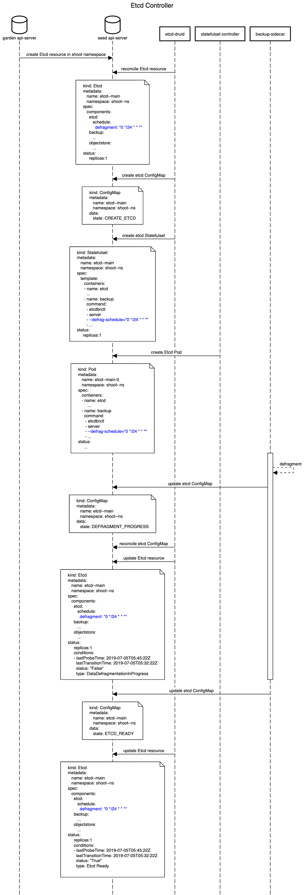

# ETCD Druid
## Background
[ETCD](https://github.com/etcd-io/etcd) in the control plane of Kubernetes clusters managed by Gardener is  deployed as a Statefulset. The statefulset has a replica of one pod having two containers namely, etcd and [backup-restore](https://github.com/gardener/etcd-backup-restore). Etcd container interfaces with the etcd-backup-restore before etcd startup via REST apis in a bash script to perform data validation. If the validation fails, the latest snapshot in the cloud-provider object-store is restored to the etcd directory. Once etcd has started, the etcd-backup-restore takes periodic full and delta snapshots. It performs periodic defragmentation of etcd data as well. 

The etcd-backup-restore requires as its input the cloud-provider information comprising of security credentials to access the object store, the object-store bucket name and prefix for the directory to push/pull snapshots. Currently, for operations like migration and validation, the bash script has to be updated to initiate the operation. 

## Goals
* Deploy etcd and etcd-backup-restore using an Etcd CRD.
* Support replicas for etcd greater than one.
* Perform scheduled snapshots.
* Support opertions such as restores, defrags and scaling with zero-downtime.
* Handle cloud-provider specific operation logic.
* Trigger a full backup on request before volume deletion.
* Offline compaction of full and delta snapshots in objectstore.

## Proposal
The existing method of deploying etcd and backup-sidecar as a StatefulSet alleviates the pain of ensuring the pods are live and ready after node crashes. However, deploying etcd as a Statefulset also brings a plethora of challenges. The etcd controller should be smart enough to handle etcd statefulsets taking into account limitations imposed by statefulsets.

## CRD specification
The Etcd CRD should contain the information required to create the etcd and backup-restore sidecar in a pod/statefulset.
```yaml
--- 
apiVersion: etcd.gardener.cloud/v1alpha1
kind: Etcd
metadata: 
  annotations: 
    checksum/secret-etcd-backup: 099ac6cdc29c12bcb85d32ce7
    checksum/secret-etcd-ca: bde8206760da95841e486167
    checksum/secret-etcd-client-tls: a5e7a016dbd91ef64933f24
    checksum/secret-etcd-server-tls: 05a7dbe89a97926ba7c076
  labels: 
    app: etcd-statefulset
    role: main
  name: shoot--name--etcd--main
  namespace: shoot--name--namespace
spec: 
  components: 
    metadata: 
      annotations: 
        checksum/secret-etcd-backup: 099ac6cdc29c12bcb85d32ce7
        checksum/secret-etcd-ca: bde8206760da95841e486167
        checksum/secret-etcd-client-tls: a5e7a016dbd91ef64933f24
        checksum/secret-etcd-server-tls: 05a7dbe89a97926ba7c076
      labels: 
        app: etcd-statefulset
        role: main
    spec: 
      backup: 
        deltaSnapshotMemoryLimit: 104857600
        deltaSnapshotPeriodSeconds: 300
        garbageCollectionPeriodSeconds: 43200
        resources: 
          limits: 
            cpu: 500m
            memory: 1Gi
          requests: 
            cpu: 100m
            memory: 250Mi
        schedule: 
          fullSnapshot: "0 */24 * * *"
        tempSnapDir: /var/etcd/data/temp
      etcd: 
        version: "v3.3.13"
        dataDir: /var/etcd/data/new.etcd
        stoargeCapacity: 10Gi
        storageclass: gardener-fast
        etcdConfig: 
          name: config-map-name
          namespace: config-map-namespace
        etcdConnectionTimeout: 300
        resources: 
          limits: 
            cpu: 500m
            memory: 1Gi
          requests: 
            cpu: 100m
            memory: 250Mi
        schedule: 
          defragmentation: "0 */24 * * *"
        serviceName: etcd-main
        tls: 
          cacert: /var/etcd/ssl/ca/ca.crt
          cert: /var/etcd/ssl/client/tls.crt
          insecureSkipTlsVerify: false
          insecureTransport: false
          key: /var/etcd/ssl/client/tls.key
      objectStore: 
        region: eu-central-1
        secretRef: 
          name: secret_name
          namespace: secret_namespace
        storageContainer: shoot--dev--i308301-2--83abc
        storageProvider: S3
        storePrefix: etcd-main
  replicas: 1
  selector: 
    matchLabels: 
      app: etcd-statefulset
      role: main
status: 
  conditions: 
    - 
      lastProbeTime: ~
      lastTransitionTime: 2019-07-05 05:32:22 +00:00
      status: "True"
      type: DataDefragmentationInProgress
    - 
      lastProbeTime: ~
      lastTransitionTime: 2019-07-05 05:32:22 +00:00
      status: "True"
      type: RollOutInProgress
    - 
      lastProbeTime: ~
      lastTransitionTime: 2019-07-05 05:34:22 +00:00
      status: "True"
      type: EtcdReady
    - 
      lastProbeTime: ~
      lastTransitionTime: 2019-07-05 05:32:22 +00:00
      status: "True"
      type: EtcdPodDeployed
    - 
      lastProbeTime: ~
      lastTransitionTime: 2019-07-05 05:32:22 +00:00
      status: "True"
      type: DataDirectoryVerified
  currentReplicas: 1
  currentRevision: 1
  endpoints: 
    - 
      endpoint: "etcd-main-0:2379"
      name: etcd-main-0
      state: Ready
  lastError: nil
  lastOperation: 
    description: ~
    lastUpdateTime: ~
    progress: ~
    state: ~
    type: ~
  observedGeneration: 1
  ready: true
  readyReplicas: 1
  replicas: 1
  serviceName: etcd-main
  updatedReplicas: 0
  updatedRevision: 2
```
If we need to accomodate HVPA with etcd CRD then we could modify the CRD to have template hierarcy. HVPA uses a fixed template to update the resource specification for Statefulset and Deployments as shown below.
```yaml
spec: 
  template: 
    spec: 
      containers: 
        - resources: 
            limits: 
              cpu: 500m
              memory: 1Gi
            requests: 
              cpu: 100m
              memory: 250Mi
```
 Another proposal for Etcd CRD spec to seamlessly enable HVPA to update the resource specifications for Etcd.
```yaml
--- 
apiVersion: etcd.gardener.cloud/v1alpha1
kind: Etcd
metadata: 
  annotations: 
    checksum/secret-etcd-backup: 099ac6cdc29c12bcb85d32ce7
    checksum/secret-etcd-ca: bde8206760da95841e486167
    checksum/secret-etcd-client-tls: a5e7a016dbd91ef64933f24
    checksum/secret-etcd-server-tls: 05a7dbe89a97926ba7c076
  labels: 
    app: etcd-statefulset
    role: main
  name: shoot--name--etcd--main
  namespace: shoot--name--namespace
spec: 
  backup: 
    deltaSnapshotMemoryLimit: 104857600
    deltaSnapshotPeriodSeconds: 300
    garbageCollectionPeriodSeconds: 43200
    schedule: 
      fullSnapshot: "0 */24 * * *"
    tempSnapDir: /var/etcd/data/temp
  etcd: 
    version: "v3.3.13"
    dataDir: /var/etcd/data/new.etcd
    etcdConfig: 
      name: config-map-name
      namespace: config-map-namespace
    etcdConnectionTimeout: 300
    schedule: 
      defragmentation: "0 */24 * * *"
    serviceName: etcd-main
    stoargeCapacity: 10Gi
    storageclass: gardener-fast
    tls: 
      cacert: /var/etcd/ssl/ca/ca.crt
      cert: /var/etcd/ssl/client/tls.crt
      insecureSkipTlsVerify: false
      insecureTransport: false
      key: /var/etcd/ssl/client/tls.key
  objectStore: 
    region: eu-central-1
    secretRef: 
      name: secret_name
      namespace: secret_namespace
    storageContainer: shoot--dev--i308301-2--83abc
    storageProvider: S3
    storePrefix: etcd-main
  replicas: 1
  selector: 
    matchLabels: 
      app: etcd-statefulset
      role: main
  template: 
    metadata: 
      annotations: 
        checksum/secret-etcd-backup: 099ac6cdc29c12bcb85d32ce7
        checksum/secret-etcd-ca: bde8206760da95841e486167
        checksum/secret-etcd-client-tls: a5e7a016dbd91ef64933f24
        checksum/secret-etcd-server-tls: 05a7dbe89a97926ba7c076
      labels: 
        app: etcd-statefulset
        role: main
    spec: 
      containers: 
        - 
          name: etcd
          resources: 
            limits: 
              cpu: 500m
              memory: 1Gi
            requests: 
              cpu: 100m
              memory: 250Mi
        - 
          name: backup
          resources: 
            limits: 
              cpu: 500m
              memory: 1Gi
            requests: 
              cpu: 100m
              memory: 250Mi
status: 
  conditions: 
    - 
      lastProbeTime: ~
      lastTransitionTime: 2019-07-05 05:32:22 +00:00
      status: "True"
      type: DataDefragmentationInProgress
    - 
      lastProbeTime: ~
      lastTransitionTime: 2019-07-05 05:32:22 +00:00
      status: "True"
      type: RollOutInProgress
    - 
      lastProbeTime: ~
      lastTransitionTime: 2019-07-05 05:34:22 +00:00
      status: "True"
      type: EtcdReady
    - 
      lastProbeTime: ~
      lastTransitionTime: 2019-07-05 05:32:22 +00:00
      status: "True"
      type: EtcdPodDeployed
    - 
      lastProbeTime: ~
      lastTransitionTime: 2019-07-05 05:32:22 +00:00
      status: "True"
      type: DataDirectoryVerified
  currentReplicas: 1
  currentRevision: 1
  endpoints: 
    - 
      endpoint: "etcd-main-0:2379"
      name: etcd-main-0
      state: Ready
  lastError: nil
  lastOperation: 
    description: ~
    lastUpdateTime: ~
    progress: ~
    state: ~
    type: ~
  observedGeneration: 1
  ready: true
  readyReplicas: 1
  replicas: 1
  serviceName: etcd-main
  updatedReplicas: 0
  updatedRevision: 2

```

## Implementation Agenda
We shall target defragmentation during maintenence window as the first step. Subsequently, we shall attempt to perform zero-downtime upgrades and defragmentation.

## Workflow
### Deployment workflow

### Defragment workflow

